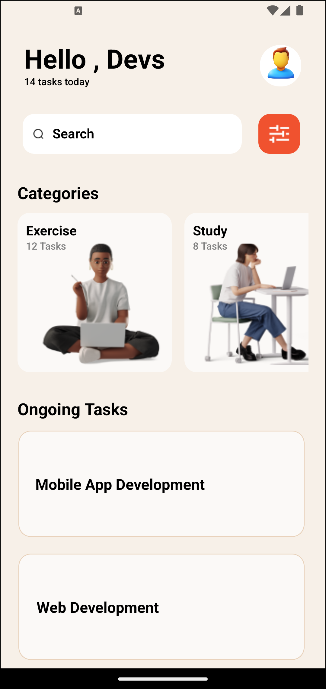
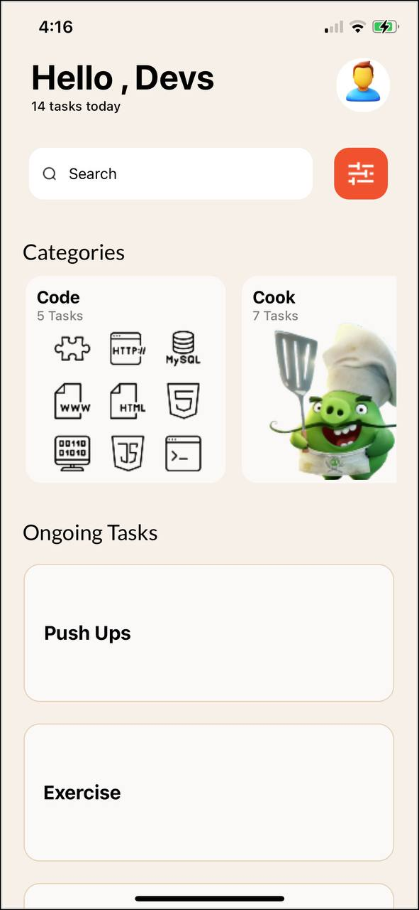

# rn-assignment3-11012578

## Introduction

This React Native app displays a task management interface, including various categories and ongoing tasks. It uses the expo-font package for custom fonts and showcases how to integrate images, search functionality, and styled components within a React Native application.

## Features

- **Visual Excellence**: Enjoy stunning visuals with beautifully designed categories and ongoing tasks.
- **Effortless Navigation**: Experience smooth navigation with intuitive user interface elements.

- **Dynamic Search**: Easily find what you're looking for with our dynamic search feature that adapts as you type.

- **Vibration Feedback**: Feel the interaction with subtle vibrations upon pressing buttons, enhancing your sense of control.

## Compatibility

- **Cross-Platform**: Compatible with both Android and iOS devices, ensuring a consistent experience across platforms.

- **Device Feedback**: Experience device-specific feedback, including haptic feedback on supported devices.

## Components Overview

### App

The main component of the application. It renders the entire UI, including the header, search bar, categories list, and ongoing tasks list.

#### State Variables:

- searchText: Holds the text input value from the search bar.
- fontsLoaded: Determines if the custom fonts have been loaded.

#### Lifecycle Methods:

- useEffect: Loads custom fonts when the component is mounted.

### categories

An array of objects representing task categories. Each object contains:

- id: Unique identifier for the category.
- name: Name of the category.
- tasks: Number of tasks in the category.
- image: Path to the category image.

### loadFonts

Asynchronous function that loads the custom font Lato using expo-font.

### renderCategoryItem

A helper function to render individual category items in the FlatList.

### Styles (styles)

An object containing style definitions for various components using StyleSheet.create.

## UI Components

### View: container

The main container for the app, setting the background color and ensuring the layout is centered.

### View: frame1

Contains the header section with the greeting text and profile image.

#### Sub-components:

- View: textContainer
  - Text: text1: Displays the greeting "Hello, Devs".
  - Text: text2: Displays the number of tasks for today.
- View: profileImageContainer
  - View: ellipse1: Background ellipse for the profile image.
  - Image: image1: Profile image.

### View: frame2

Contains the search bar and a menu button.

#### Sub-components:

- View: textContainer1
  - Image: searchIcon: Icon for the search bar.
  - Text: text3: Placeholder text "Search" when searchText is empty.
  - TextInput: searchBar: Input field for the search bar.
- Pressable: Menu button
  - View: ellipse2: Background for the menu button.
  - Image: image2: Menu icon.

### Text: text4

Header for the "Categories" section.

### FlatList: categoryListContainer

Horizontal list of category cards.

### View: categoryCard

Individual category card displaying the category image, name, and task count.

#### Sub-components:

- Image: categoryImage: Image representing the category.
- View: categoryTextContainer
  - Text: categoryName: Name of the category.
  - Text: categoryTasks: Number of tasks in the category.

### Text: text5

Header for the "Ongoing Tasks" section.

### ScrollView: scrollView

Vertical scroll view containing the list of ongoing tasks.
It's generally better to use a ScrollView only for the ongoingTask cards, rather than wrapping the entire app in a ScrollView.
This helps to improve:

- 1. Performance: Using a single ScrollView for the entire app can lead to performance issues, especially if you have a lot of content or complex components.
- 2. Layout: A ScrollView takes up the entire screen, which can make it difficult to manage the layout of other components, like headers, footers, or other elements that shouldn't scroll.
- 3. User experience: Scrolling the entire app can be overwhelming and make it harder for users to navigate and focus on specific sections.

By using a ScrollView only for the ongoingTask cards, you can:

- 1. Contain the scrolling behavior to a specific section of the app.
- 2. Improve performance by only scrolling a smaller portion of the content.
     Enhance the user experience by keeping the app's layout and navigation more organized and intuitive.

### View: ongoingTaskCard

Individual card for each ongoing task.

#### Sub-components:

- Text: ongoingTaskName: Name of the ongoing task.

## Styles

### General Styles

- backgroundColor: Sets the background color for various components.
- alignItems & justifyContent: Centers content horizontally and vertically.
- flexDirection: Defines the layout direction of child components (row/column).
- paddingHorizontal & paddingVertical: Adds horizontal and vertical padding.
- position & top/left: Positions components absolutely relative to their parent.

### Specific Styles

- borderWidth & borderColor: Sets border width and color.
- borderRadius: Rounds the corners of components.
- fontWeight, fontSize, lineHeight, color: Styles for text elements.

## Usage

### Running the App

1. Ensure you have expo-cli installed.
2. Clone the repository.
3. Navigate to the project directory and run npm install.
4. Start the app with expo start.

### Customizing

- _Categories_: Modify the categories array to add, remove, or update categories.
- _Fonts_: Change the font by updating the loadFonts function and relevant styles.
- _Styles_: Update the styles object to customize the appearance of components.

### Example Customization

To add a new category:

1. Add a new entry to the categories array:
   javascript
   { id: '11', name: 'New Category', tasks: 4, image: require('./assets/new_category.png') }
2. Ensure the image path is correct and the image exists in the assets directory.

3. Update the renderCategoryItem function to include the new category image:

   javascript
   <Image source={item.image} style={styles.categoryImage} />

4. Ensure the styles for categoryImage, categoryName, and categoryTasks are appropriate for the new category card.

### Additional Notes

- Ensure all images referenced in the application exist in the assets directory.
- Test the application thoroughly after making any customizations to ensure proper functionality and styling.

### Mobile App - Walkthrough

This walkthrough video will guide you through the key features of the App.

- 1. `View of Expo App.`

  

|               Android Emulator                                      |           Expo Go (iPhone)                              |
| ------------------------------------------------------------------- | ------------------------------------------------------- |
|  |  |

- 2. `Live View.`
     Screenrecording from `Expo go` on `iPhone`.

  

|                   VS Code                                                                |           GitHub                                        |
| ---------------------------------------------------------------------------------------- | ------------------------------------------------------- |
| <video width="250" height="543" controls><source src="./Devs/assets/Record.MP4"></video> | https://github.com/0verdoz/rn-assignment3-11012578/assets/151379914/48325aff-875d-4186-ac23-1e2570d2057e|

### DEMO

https://github.com/0verdoz/rn-assignment3-11012578/assets/151379914/8426b27e-afb0-4f85-9fad-4fa12effe432

## Installation Guide

1. Clone the repository to your local machine.
2. Install the necessary dependencies using your preferred package manager.
3. Run the app on your device or emulator and start organizing your tasks with ease!

## TO EXPERIENCE BUTTON FEEDBACK RUN ON EXPO GO.

## Conclusion

This README provides a comprehensive overview of the components, UI elements, styles, and usage instructions for the React Native task management app. By following the instructions provided, developers can easily understand, customize, and extend the application to meet their specific requirements.
